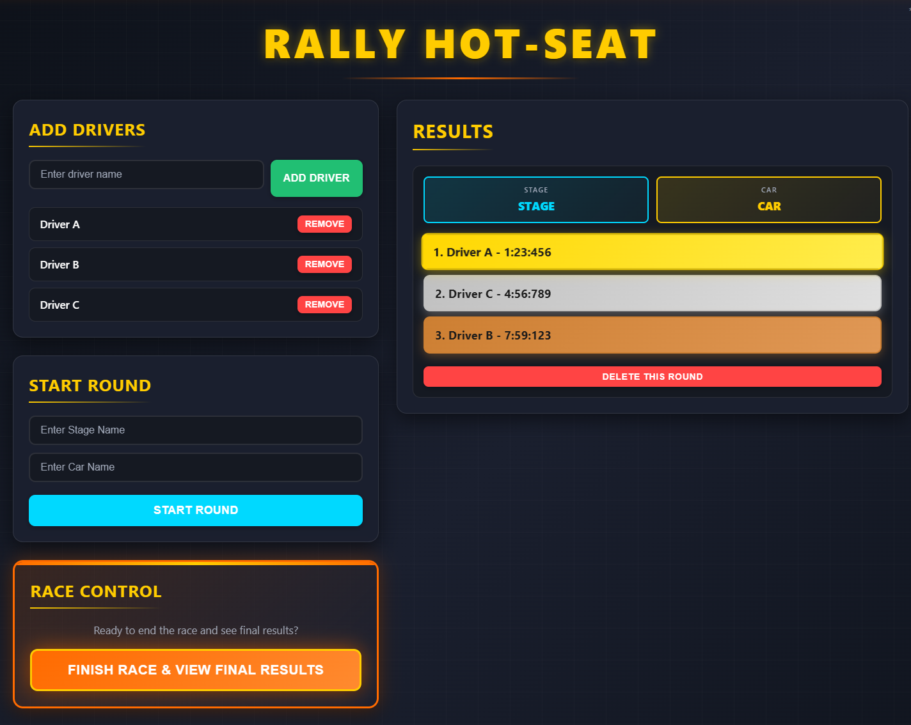

# Rally Hot-Seat Web

A lightweight browser-based rally timing manager for local hot-seat races.

Designed for quick stage tracking between friends without spreadsheets or external tools.

---

## 📌 Overview

Rally Hot-Seat Web allows you to:

- Add multiple drivers
- Create rally rounds (stage + car)
- Enter stage times in `MM:SS:MMM` format
- Automatically calculate differences
- Display final overall results
- Continue the race or start a new one

Everything runs fully client-side — no backend required.

---

## ⚙️ How It Works

1. Add your drivers  
2. Start a round (enter stage name + car)  
3. Input times in format: `00:00:000`
4. Finish the round
5. Repeat for all stages
6. Click **Finish Race** to see your final standings

A modal will display final times and time gaps

---

## 🚫 DSQ Handling

- `DSQ` is currently treated as **15:00:000**
- You cannot DSQ all drivers (race cannot finish)
- Temporary workaround: Instead of typing `DSQ`, enter: `15:00:000`

(Custom DSQ logic is planned for future updates.)

## 🛠 Tech Stack

- HTML5  
- CSS3  
- Vanilla JavaScript  
- Hosted via GitHub Pages  

No frameworks. No dependencies. Pure front-end.
---

## 🔮 Planned Improvements

- [ ] **Customizable DSQ time**  
- [ ] **Proper DSQ logic handling** 
- [x] **Cleaner animation system**  
- [x] **Refactored gradients & styling**
- [x] **UI polish** 
- [x] **Codebase cleanup**  

---

## 📷 Preview
  

## 🚀 Live Version

### Hosted via GitHub Pages:
#### <a href="https://poctacek.github.io/rallyhotseat">poctacek.github.io/rallyhotseat</a>

---
## 📜 License

Open-source. Use, modify, improve. :)

- *this project is only in it's starting stages, and I don't have much time cuz of school, so don't expect updates on a regular basis :(*